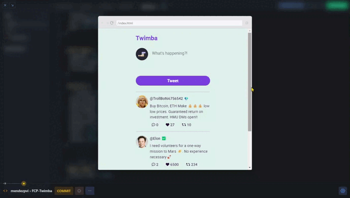

# Twimba

## *Overview* 🌟

The Twimba project is a simple Twitter-like app that lets users create tweets, like, retweet, and view replies. This project is part of the **"Essential JavaScript Concepts"** module from [**Scrimba**](https://v2.scrimba.com/home)'s [**Frontend Career Path**](https://v2.scrimba.com/the-frontend-developer-career-path-c0j) course. The app dynamically renders tweets, updates like and retweet counts, and provides basic tweet interactivity through event listeners.

## *Stretch Goals* 😔

❌ Add the ability to reply to a specific tweet.

❌ Save tweets, likes and retweets to localStorage.

❌ Allow a user to delete a tweet.

❌ Your own idea!

## *Screenshots* 📷

## *Pseudocode* 📝

1. Export **tweetsData**.
1. Generate tweetHTML for each tweet.
1. Render tweets in the DOM.
1. Listen for dataset attributes on each button.
1. Filter tweets based on the dataset to retrieve the tweet object.
1. Increase or decrease likes/retweets and re-render updated values, applying conditional styles.
1. Render replies if they exist.
1. Import `uuid` to generate unique tweet IDs.
1. Retrieve form input values, create a new tweet object using the input, and add it to tweetsData.

## *Links* 🔗

[Scrim code](https://v2.scrimba.com/s06ak88cnn) 👈

[Live site](https://mendezpvi.github.io/fcp-twimba/) 👈

[Scrimba projects repository](https://github.com/mendezpvi/fcp-scrimba) 👈

## *What I learned* 🤓

🔳 Using `<textarea>` for tweet input.

🔳 Using `.forEach()` to iterate over arrays.

🔳 Handling `data-` attributes to differentiate actions (reply, like, retweet).

🔳 Conditionally rendering styles (e.g., applying different classes).

🔳 Using the `NOT` operator (`!`) to toggle states.

🔳 Implementing CDN resources:
+ Adding Font Awesome icons.
+ Generating unique IDs with uuid.

🔳 Rendering HTML with `.insertAdjacentHTML('beforeend', ...)`. This method allows you to insert HTML into a specific position within a parent element. The `'beforeend'` argument places the new HTML as the last child of the selected element, making it useful for dynamically adding content without overwriting existing elements.

🔳 Using `e.target.closest()` to handle button events. This method traverses up the DOM tree from the clicked element (event target) to find the nearest ancestor that matches a specified selector. It's useful for handling events when you want to identify the parent element related to the clicked button, especially in cases where multiple similar elements share event listeners.

🔳 Enhancing accessibility with `aria-labelledby` and `sr-only` classes. The aria-labelledby attribute improves accessibility by linking an element (like a form) to a visible label, making it easier for screen readers to convey context. The sr-only class is used to visually hide elements while keeping them available for screen readers, providing necessary information without cluttering the interface.

## *Resources* 🗃️

🗃️ [Frontend Career Path](https://v2.scrimba.com/the-frontend-developer-career-path-c0j) by Scrimba

🗃️ [insertAdjacentHTML() method](https://developer.mozilla.org/en-US/docs/Web/API/Element/insertAdjacentHTML) by MDN

## *Author* 🔰

✨ Frontend Mentor - [@medezpvi](https://www.frontendmentor.io/profile/mendezpvi)

✨ X (formerly Twitter) - [@medezpvi](https://x.com/mendezpvi)